# Smart Table Tennis Bat with Live Analytics

**Created By:** Samuel Alexander  
**Edge Impulse Public Project:** https://studio.edgeimpulse.com/public/732429/live  
**GitHub Repository:** https://github.com/SamuelAlexander/smart-table-tennis-bat-with-edge-impulse  
**Demonstration video:** https://youtu.be/uuwvcWkOnFA

---

## Table of Contents
1. [Problem Exploration](#problem-exploration)
2. [Project Overview](#project-overview)
3. [Why This Tech Stack?](#why-this-tech-stack)
4. [Hardware Requirements](#hardware-requirements)
5. [Software Requirements](#software-requirements)
6. [How it works](#how-it-works)
7. [Dataset Collection](#dataset-collection)
8. [Impulse Design](#impulse-design)
9. [Hardware Assembly](#hardware-assembly)
10. [Software Implementation](#software-implementation)
11. [User Interface & Experience](#user-interface--experience)
12. [Conclusion](#conclusion)

---

## Problem Exploration

You're practicing table tennis, working on technique improvements. Your forehand feels stronger today, but is it really? Are you hitting with better consistency than last week? Without a coach watching, there's no way to know if you're actually improving or just feeling confident. This highlights a core challenge in table tennis training: **the lack of real-time, objective feedback**.

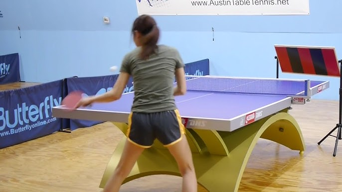

**Image credit: Wally Table Tennis**

### Current Pain Points:
- **Manual stroke counting** is error-prone and distracting from technique
- **No objective feedback** on stroke distribution during practice
- **No data tracking** for performance improvement over time

### What's Needed:
- **Auto-count** each stroke type (drives, loops, smashes)
- **Filter out** noise and movements between strokes
- **Instant motivation** with real-time feedback after each stroke
- **Standalone operation** - no phone or PC required
- **Feels like a real bat** - similar weight and balance

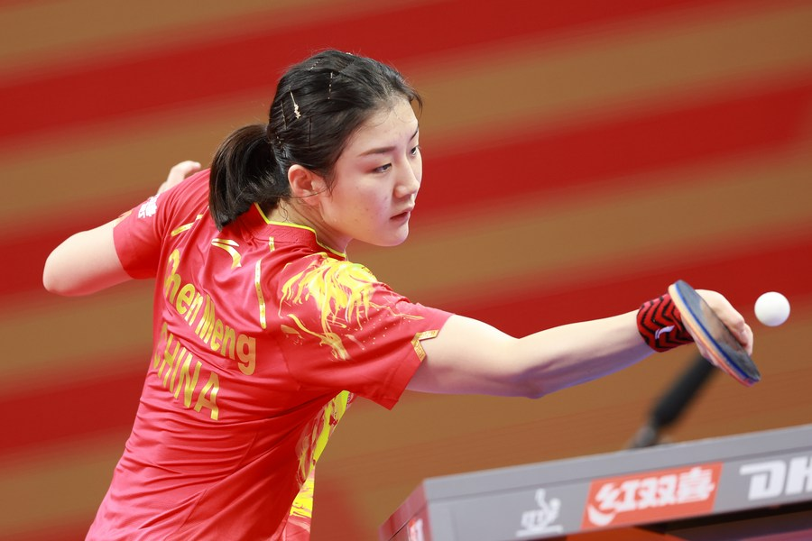

**Image credit: Xinhua News**

---

## Project Overview
I built a smart table tennis bat by embedding an **Arduino Nano 33 BLE Sense Rev2** in a 3D-printed handle, attached to a real blade and rubber. The bat's **BMI270 + BMM150 IMU** captures motion data and feeds it to an AI model trained with **Edge Impulse Studio**.


### Key Features:
- **Real-time stroke detection** - recognizes 5 stroke types + idle
- **Fast response** - new detection every 250ms with sliding windows
- **Smart filtering** - confidence checks + 2g threshold to avoid false positives
- **OLED display** - shows stroke counts and motivational messages
- **Battery powered** - just charge and play, no cables
- **Real bat feel** - careful weight distribution


```text
+---------------------------+           50 Hz samples            +---------------------------+
| BMI270/BMM150 IMU        |  accX,accY,accZ,gyrX,gyrY,gyrZ  ->  | Arduino Nano 33 BLE Sense |
| (accelerometer + gyro)   |                                     | Rev2 (C++/Arduino)        |
+---------------------------+                                    | - Circular buffer (500 ms)|
                                                                 | - Sliding window (250 ms) |
                                                                 +------------+--------------+
                                                                              |
                                                                              v
                                                                +-------------+--------------+
                                                                | Spectral Analysis (FFT-32) |
                                                                | - 6 axes, frequency domain |
                                                                +-------------+--------------+
                                                                              |
                                                                              v
                                                                +-------------+--------------+
                                                                | Neural Network Classifier  |
                                                                | 20 -> 10 -> 6 (INT8)       |
                                                                +-------------+--------------+
                                                                              |
                                                         argmax, conf>0.75, accel>2g, cooldown
                                                                              |
                                                                              v
+---------------------------+                                   +---------------------------+
| LiPo Battery (400 mAh)    |                                   | SSD1306 128x32 OLED       |
| -> Power to Arduino/IMU   |                                   | - Stroke counts (BH/FH)   |
+---------------------------+                                   | - Messages, idle anim     |
                                                                +---------------------------+

```
**System Architecture Diagram**

---

## Why This Tech Stack?

### Arduino Nano 33 BLE Sense Rev2
- **Built-in IMU** (BMI270/BMM150) for 6-axis motion data  
- **Cortex-M4** core (64 MHz) runs TensorFlow Lite models  
- **BLE 5.0** for future mobile app features
- **Tiny size** (45×18mm) fits in bat handle
- **Low power** for long battery life
- **Arduino ecosystem** with tons of libraries

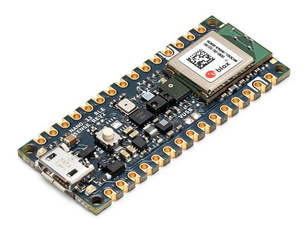

**Arduino Nano 33 BLE Sense Rev2**

### Edge Impulse Studio
Edge Impulse makes Edge AI simple:
- **Upload CSV data** with automatic labeling
- **Built-in signal processing** and feature extraction
- **AutoML** finds the best model architecture
- **Deploy** as Arduino library
- **Handles all the ML complexity** in an intuitive UI
- **Performance analysis** with charts and metrics


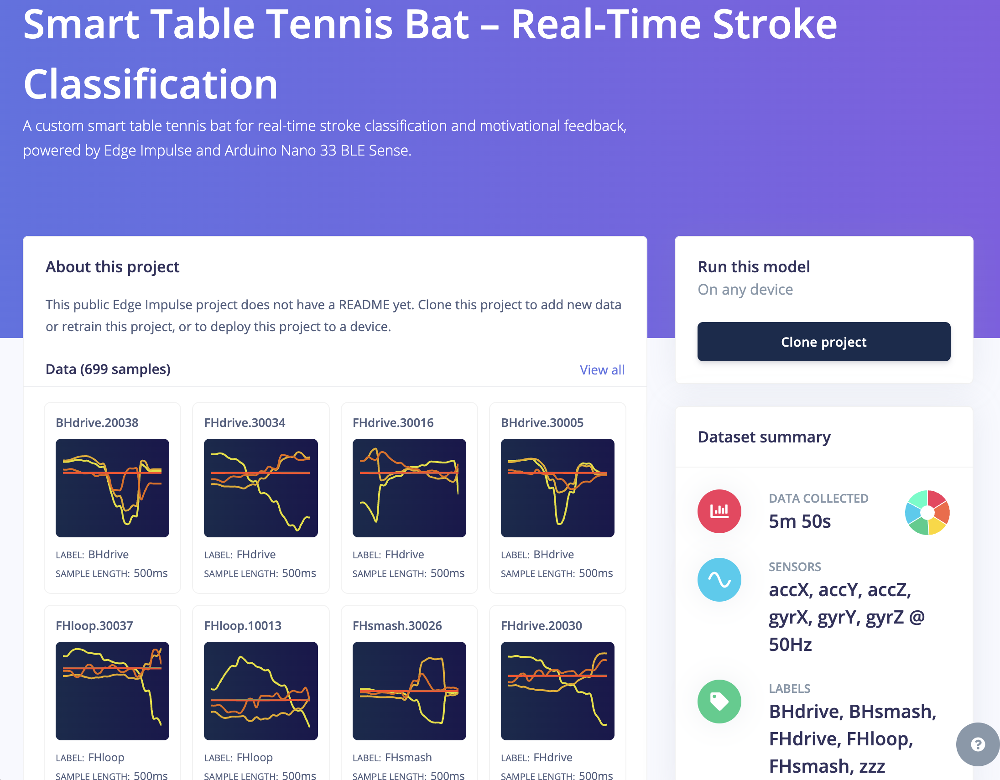

**Edge Impulse Studio Project Dashboard**

---

## Hardware Requirements

### Core Components:
- **Arduino Nano 33 BLE Sense Rev2** - Main microcontroller with built-in IMU
- **SSD1306 128×32 OLED Display** - I2C interface for real-time stats and feedback
- **LiPo Battery** (400mAh recommended) + JST connector
- **Boost converter** (steps LiPo output up to 5V for Arduino Vin)
- **3D-printed handle components** (STL files provided)
- **Table tennis blade** (pre-made blade with removed handle or custom order)
- **Table tennis rubbers** (2.1mm thickness recommended)

### Tools & Materials:
- Soldering iron and solder
- PVAC glue
- Table tennis glue/adhesive
- 3D printer (PLA filament)
- Wire strippers
- Small screwdriver set

### Estimated Cost: **$95-210 USD**


---

## Software Requirements

### Development Environment:
- **Arduino IDE** 2.0+
- **Edge Impulse CLI** (optional, for data collection)
- **Edge Impulse Studio** account (free tier sufficient)

### Arduino Libraries:
```cpp
#include "Arduino_BMI270_BMM150.h"  // IMU sensor library
#include <Wire.h>                   // I2C communication
#include "Adafruit_SSD1306.h"       // OLED display
#include "Adafruit_GFX.h"           // Graphics library
#include "[ProjectName]_inferencing.h" // Generated Edge Impulse library
```


---

## How it works

We sample 6-axis motion at 50 Hz and keep a 500 ms rolling window with a 250 ms hop, which balances quick updates with stable predictions. Each window is turned into FFT-32 spectral features on all axes and fed to a compact INT8 neural network (20→10→6) that classifies five stroke types plus idle. Spectral features capture the rhythmic patterns that separate drives, loops and smashes more reliably than raw signals, which is why the model can give consistent feedback while you are still hitting. A lightweight decision layer uses argmax, confidence above 0.75, an acceleration gate above 2 g, and a short cooldown to cut false positives from handling and ball bounces. The OLED updates immediately with counts and messages so you get actionable feedback mid-drill, and the full loop completes in about 250 to 500 ms.


### Performance:
On-device inference runs in about 12 ms with the INT8 model. End-to-end response from stroke to display is typically 250 to 500 ms. Battery life is around 2.5 hours per session. Offline evaluation shows 96.4% validation accuracy and 88.7% test accuracy.

---

## Dataset Collection

### Stroke Categories:
- **BHdrive**: Backhand drive (equal ratio of spin and hit)
- **BHsmash**: Backhand smash (flat hit offensive shot)
- **FHdrive**: Forehand drive (equal ratio of spin and hit)
- **FHloop**: Forehand loop (spinny offensive shot)
- **FHsmash**: Forehand smash (flat hit offensive shot)
- **zzz**: Idle state (no stroke, subtle movement in between shots)


### Data Collection Process:

The data collection uses a simple web app on your phone that connects to the Arduino via Bluetooth. Two parts work together:

#### 1. Arduino Data Collection Firmware

The Arduino runs specialized firmware (`table-tennis-data-collection-bluetooth.ino`) that handles:

**Swing Detection Algorithm:**
```cpp
// Motion thresholds for automatic stroke detection
#define ACCEL_THRESHOLD 2.0  // 2G acceleration
#define GYRO_THRESHOLD 200.0 // 200 degrees/second
#define COOLDOWN_MS 200      // 200ms between detections

// Automatic swing detection
float totalAccel = sqrt(ax*ax + ay*ay + az*az);
float totalGyro = sqrt(gx*gx + gy*gy + gz*gz);

if (totalAccel > ACCEL_THRESHOLD && totalGyro > GYRO_THRESHOLD) {
    swingDetected = true;
    // Capture 500ms window: 100ms pre-trigger + 400ms post-trigger
}
```

**Data Capture:**
- Keeps the last 500ms of motion data in memory
- When stroke detected, saves full 500ms (100ms before + 400ms after)
- Sends data to phone as CSV via Bluetooth

#### 2. Web App Interface

The web app runs in your phone browser and:

**Bluetooth Connection:**
```javascript
// Connect to Arduino via Web Bluetooth API
bleDevice = await navigator.bluetooth.requestDevice({
    filters: [{ name: 'TT-Stroke-Collector' }],
    optionalServices: ['12345678-1234-1234-1234-123456789abc']
});
```

**Data Processing & Organization:**
```javascript
// Automatically organize strokes by type
const filename = `${strokeType}${(index + 1).toString().padStart(4, '0')}.csv`;
zip.file(filename, swing.csv);
```

#### 3. How to Collect Data:

1. **Setup**: Open web app on phone, upload firmware to Arduino
2. **Connect**: App finds Arduino and connects via Bluetooth
3. **Pick stroke**: Enter type like "FHdrive" or "BHsmash" 
4. **Hit balls**: System auto-detects and saves each stroke
5. **Monitor**: See swing count and time in real-time
6. **Download**: Get ZIP with numbered CSV files (`FHdrive0001.csv`, etc.)


**Web interface of the data collection app**

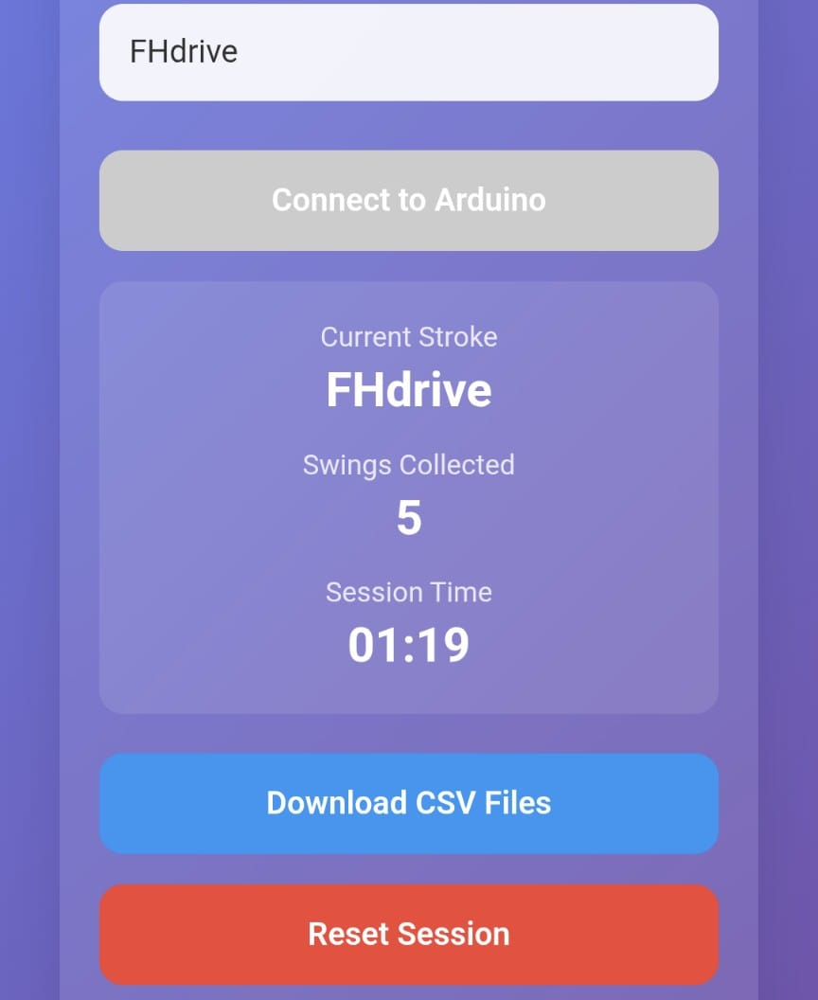

**Download ZIP of CSV files for each stroke type**

**Technical Specifications:**
1. **Sampling Rate**: 50Hz for accelerometer and gyroscope (6 channels total)
2. **Window Size**: 500ms (25 samples per window)
3. **Detection Method**: Combined acceleration (>2g) and angular velocity (>200°/s) thresholds
4. **Data Format**: CSV with headers: `Timestamp,accX,accY,accZ,gyrX,gyrY,gyrZ`
5. **Total Dataset**: ~50 seconds per class (100 samples of 500ms windows per stroke type and idle)
6. **File Organization**: Individual CSV per stroke, bundled in labeled ZIP files


### Data Collection Tips:
- Record in realistic playing conditions (on table, with ball)
- Include variation in stroke intensity and angle
- Capture edge cases (gentle shots, missed swings)
- Record idle data during normal handling and setup


### Upload to Edge Impulse Studio

1. Open Edge Impulse Studio and create a new project (or open your existing project).
2. Go to Data acquisition → Upload data.
3. Drag and drop the ZIP exported by the web app (or multiple CSVs).
4. Set Sensor type to Inertial and Sample rate to 50 Hz (if not auto-detected from CSV headers).
5. Ensure labels are correct (filenames like `FHdrive0001.csv` will map to the `FHdrive` label). Fix any mislabeled files if needed.
6. Keep the 80/20 train/test split you recorded, or use Studio’s Split function to create it.
7. Verify each sample shows 6 axes (accX/accY/accZ, gyrX/gyrY/gyrZ) and that label counts look balanced.


---

## Impulse Design

The impulse design transforms raw 6-axis IMU data into stroke classifications through a two-stage pipeline: spectral analysis for feature extraction, followed by neural network classification. Instead of using raw sensor values, we extract frequency domain features that better capture the distinctive motion signatures of different strokes. This approach proves more effective because table tennis strokes have characteristic frequency patterns—drives have different spectral content than loops or smashes.

### Edge Impulse Configuration:

#### 1. Time Series Data Setup:
- **Input Axes**: 6 (accX, accY, accZ, gyrX, gyrY, gyrZ)
- **Window Size**: 500ms
- **Frequency**: 50Hz

#### 2. Spectral Analysis:
- **Analysis Type**: FFT (Fast Fourier Transform)
- **FFT Length**: 32
- **Parameters**: Autotune (or basic parameters on free tier)

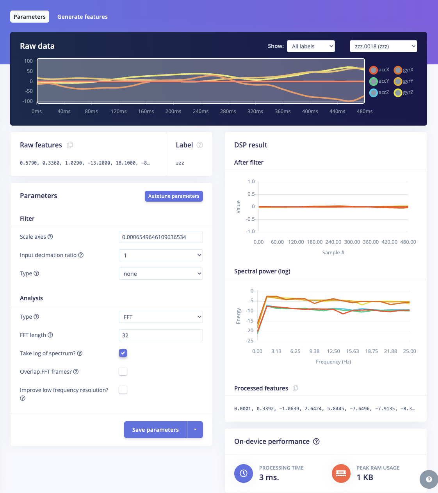
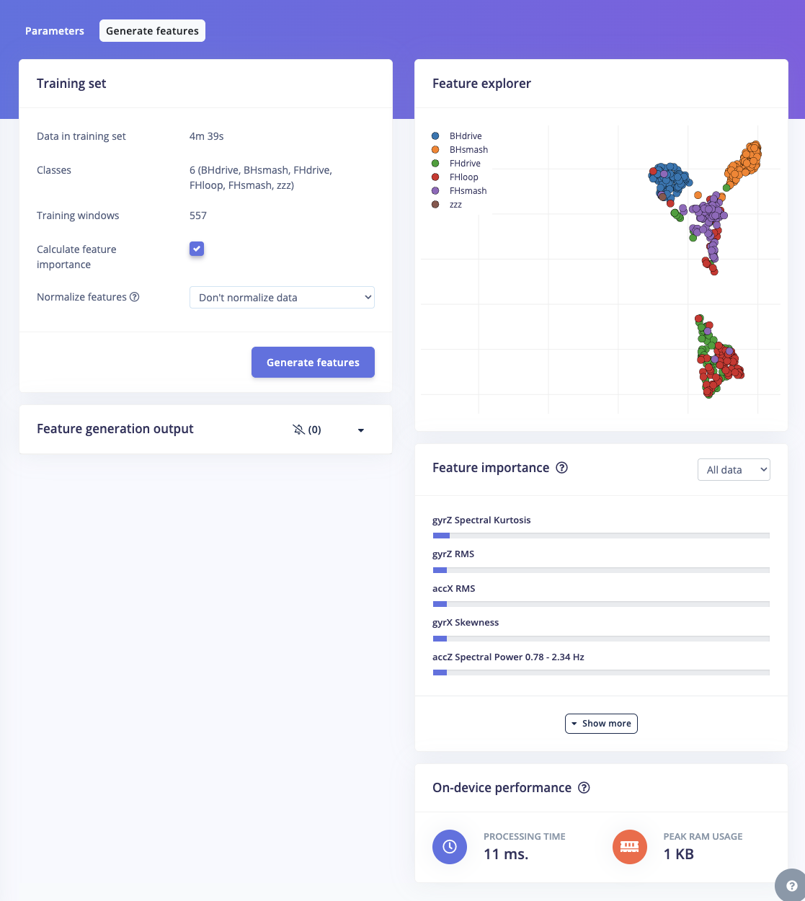

#### 3. Classifier Configuration:
- **Type**: Neural Network Classifier
- **Output Features**: 6 (BHdrive, BHsmash, FHdrive, FHloop, FHsmash, zzz)

#### 4. Neural Network Architecture:
```
Input Layer: 126 features (25 samples × 6 axes, after DSP processing)
Dense Layer 1: 20 neurons (ReLU activation)
Dense Layer 2: 10 neurons (ReLU activation)
Output Layer: 6 classes (softmax activation)
```

*Note: Edge Impulse automatically configured this default architecture when selecting the "Classifier" model, which proved effective for our stroke classification task.*

#### 5. Training Configuration:
- **Training Cycles**: 500 epochs
- **Learning Rate**: 0.0002
- **Loss Function**: Categorical crossentropy
- **Validation Split**: 20%

#### 6. Model Optimization:
- **EON Tuner**: Automated architecture search for optimal size/performance
- **Quantization Options**: Both Float32 and INT8 models available
- **Memory Usage**: 
  - **Float32**: 1.8KB RAM, 21.5KB Flash
  - **INT8**: 1.5KB RAM, 16.8KB Flash

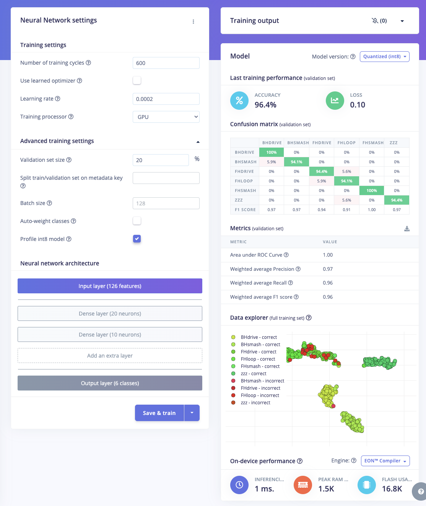

**Training parameters and performance metrics for validation set**

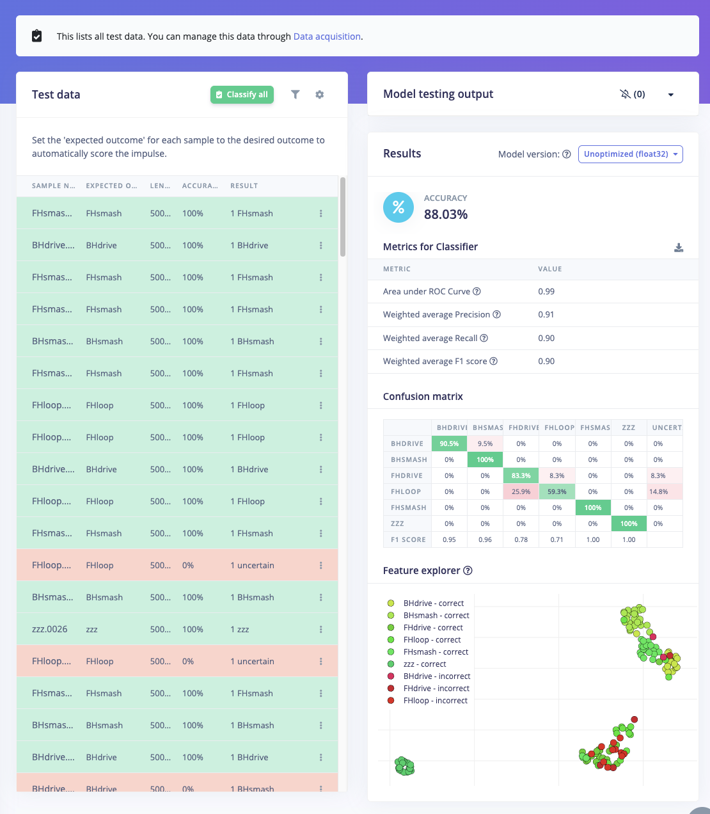

**Model performance on testing dataset**


### Model Performance:

| Model Type | Validation Accuracy | Test Accuracy | Inference Time | RAM Usage | Flash Usage |
|------------|-------------------|---------------|----------------|-----------|-------------|
| **Float32** | 96.4% | 88.0% | 13ms | 1.8KB | 21.5KB |
| **INT8** | 96.4% | 88.7% | 12ms | 1.5KB | 16.8KB |

*For this project, we deployed the **INT8** model for memory optimization while maintaining excellent accuracy.*

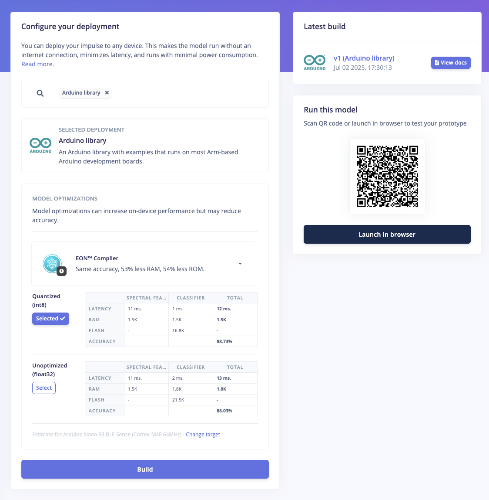

### Summary

This design achieves excellent performance through smart feature engineering. The spectral analysis extracts meaningful frequency patterns from raw motion data, while the compact neural network efficiently processes these features for real-time classification. The INT8 quantization delivers the final optimization—maintaining high accuracy while fitting comfortably within Arduino memory constraints for 12ms inference speed.

---

## Hardware Assembly

I custom ordered a table tennis blade without a handle so the build would feel like a real racket. I then designed a two part handle in Fusion 360 with hollow interiors and printed both halves. The internal cavities and simple mounts hold the Arduino Nano 33 BLE Sense Rev2, the SSD1306 OLED, a boost converter, the LiPo battery, and a small power switch. The layout keeps the weight balanced, routes the wiring inside, and leaves both the power switch and the USB port accessible for charging and firmware updates.

### Step 1: Prepare the 3D-Printed Handle
1. Print handle components using provided STL files
2. Test-fit Arduino Nano and OLED display
3. Sand/file mounting points if needed


**Fusion360 CAD model**

### Step 2: Electronics Assembly
1. **Solder connections**:
   - OLED VCC → 3.3V
   - OLED GND → GND  
   - OLED SDA → A4 (SDA)
   - OLED SCL → A5 (SCL)
   - Battery → boost converter
   - Boost converter → Arduino Vin/GND


2. **Component placement**:
   - Arduino positioned for USB access during development
   - OLED display visible through handle opening
   - Battery and boost converter positioned on the other half of the handle

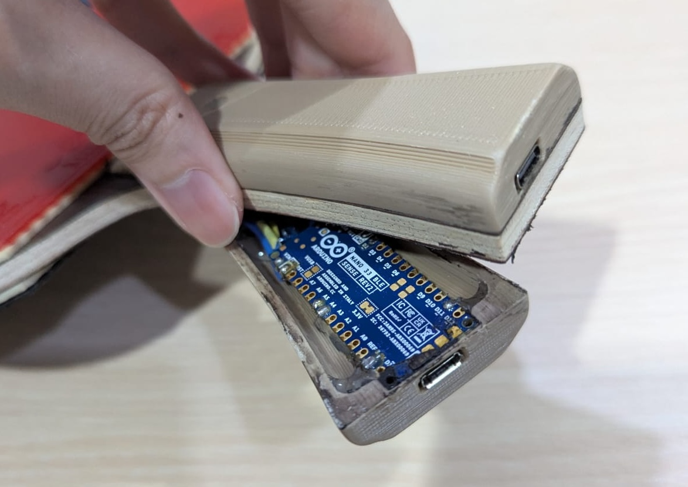

### Step 3: Handle Integration
1. Secure Arduino and OLED in printed housing
2. Route battery, boost converter, and power switch through handle
3. Seal electronics compartment
4. Test all connections before final assembly

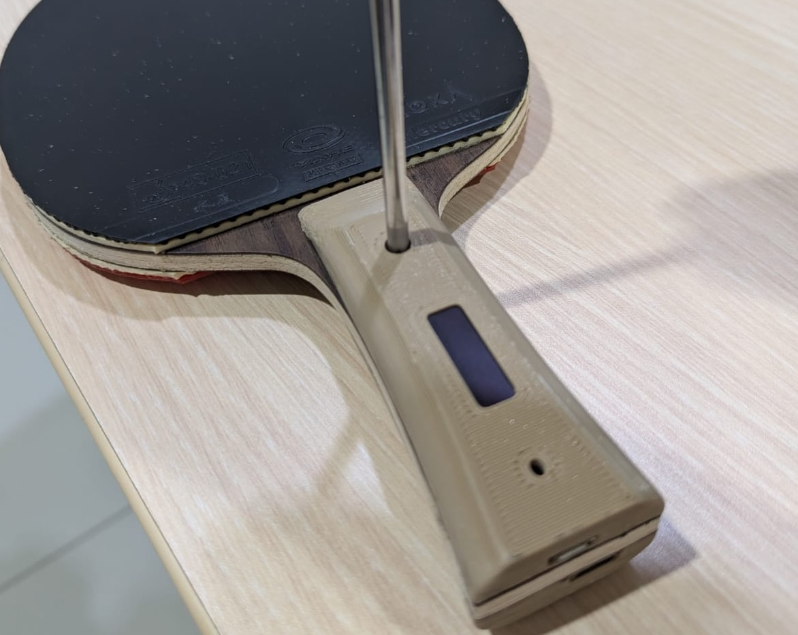

### Assembly Tips:
- Keep IMU orientation consistent with training data
- Ensure OLED is easily readable during play
- Test electronics before permanent assembly
- Consider weight distribution for natural bat feel

---

## Software Implementation

This sketch samples IMU data, builds overlapping windows, runs the Edge Impulse classifier, gates detections, and drives the OLED via a small state machine.

### Setup and model integration
```cpp
#include <Wire.h>
#include <Arduino_BMI270_BMM150.h>
#include <Adafruit_GFX.h>
#include <Adafruit_SSD1306.h>
#include <table_tennis_2_inferencing.h>

#define SCREEN_WIDTH       128
#define SCREEN_HEIGHT      32
#define OLED_RESET         -1
Adafruit_SSD1306 display(SCREEN_WIDTH, SCREEN_HEIGHT, &Wire, OLED_RESET);
```

### Timing, windowing and thresholds
```cpp
#define SAMPLE_INTERVAL_MS    20    // 50Hz sampling
#define WINDOW_SIZE           EI_CLASSIFIER_DSP_INPUT_FRAME_SIZE
#define AXIS_COUNT            EI_CLASSIFIER_RAW_SAMPLES_PER_FRAME
#define WINDOW_SAMPLES        (WINDOW_SIZE / AXIS_COUNT)  // e.g. 25
#define HOP_SAMPLES           ((WINDOW_SAMPLES + 1) / 2)   // ~half window (~12 or 13)
#define CONF_THRESH           0.50f
#define ACCEL_THRESH_G        2.0f
```

### Buffering and sampling
```cpp
typedef float BufferRow[AXIS_COUNT];
static BufferRow imuBuffer[WINDOW_SAMPLES];
static uint16_t bufIndex = 0;
static uint16_t sampleCount = 0;    // counts until window full
static uint16_t sampleCounter = 0;  // counts since last inference

void readIMU(){
float ax=0,ay=0,az=0;
if(IMU.accelerationAvailable()) IMU.readAcceleration(ax,ay,az);
float gx=0,gy=0,gz=0;
if(IMU.gyroscopeAvailable())    IMU.readGyroscope(gx,gy,gz);
BufferRow &r = imuBuffer[bufIndex];
bufIndex = (bufIndex+1)%WINDOW_SAMPLES;
if(sampleCount<WINDOW_SAMPLES) sampleCount++;
sampleCounter++;
}
```

### Classification
```cpp
typedef struct { uint8_t index; float confidence; } InferenceResult;

InferenceResult runInference(){
static float sig[WINDOW_SIZE];
for(uint16_t i=0;i<WINDOW_SAMPLES;i++){
uint16_t p=(bufIndex+i)%WINDOW_SAMPLES;
for(uint8_t j=0;j<AXIS_COUNT;j++) sig[i*AXIS_COUNT+j]=imuBuffer[p][j];
}
signal_t signal;
if(numpy::signal_from_buffer(sig,WINDOW_SIZE,&signal)!=0) return {0,0.0f};
ei_impulse_result_t res;
if(run_classifier(&signal,&res,false)!=EI_IMPULSE_OK) return {0,0.0f};
size_t best=0;
for(size_t i=1;i<EI_CLASSIFIER_LABEL_COUNT;i++)
if(res.classification[i].value>res.classification[best].value) best=i;
return {(uint8_t)best,res.classification[best].value};
}
```

### State machine and OLED updates
```cpp
enum State { STATE_OPENING, STATE_MAIN, STATE_FLASH, STATE_IDLE };

void loop(){ uint32_t now=millis();
if(now-lastIMUread>=SAMPLE_INTERVAL_MS){ lastIMUread=now; readIMU(); }
switch(currentState){
case STATE_MAIN:
if(sampleCount>=WINDOW_SAMPLES && sampleCounter>=HOP_SAMPLES){
sampleCounter-=HOP_SAMPLES;
InferenceResult inf=runInference();
if(inf.confidence>CONF_THRESH && inf.index<IDLE_LABEL_INDEX && accelAboveThreshold()){
totalStrokes++; flashStart=now; drawFlash(inf.index); currentState=STATE_FLASH;
}
}
if(now-lastDisplay>=ANIM_INTERVAL_MS){ lastDisplay=now; drawMainScreen(); }
break;
// ... FLASH and IDLE states omitted for brevity ...
}
}
```

This loop performs overlapping inference on each hop, applies confidence and acceleration gates, and renders either the main counters or a brief flash message before returning to live detection.

---

## User Interface & Experience

The UI is built for glanceability: a small state machine switches between an opening animation, live counters, a brief centered confirmation after each detection, and a subtle idle animation when you pause. The main screen shows only BH/FH drives, smashes, loop, and a total in a consistent layout you can read while playing. Updates arrive in about 250 to 500 ms, messages are short and positive, and there is nothing to configure mid‑drill, just power on, swing, and get feedback.

Text UI mockups (128x32 OLED):

```text
Opening (4 frames)
●  ●  ●  ●  ●
[bouncing balls animation]
```

```text
Main (live counters)
BH                      FH
[=] drive: 12          [=] drive:  9
[Δ] smash:  7          [Δ] smash:  5
                       [o] loop:   6
Total: 39
```

```text
Flash (3 s)
+------------------------------+
|          Clean drive!        |
+------------------------------+
```

```text
Idle (after 10 s)
Ready? Swing!
●  ●  ●  ●  ●
[bouncing balls animation]
```

```text
State flow
OPENING -> MAIN -> (valid detection) -> FLASH -> (3 s) -> MAIN
MAIN -> (10 s idle) -> IDLE -> (valid detection) -> FLASH
```


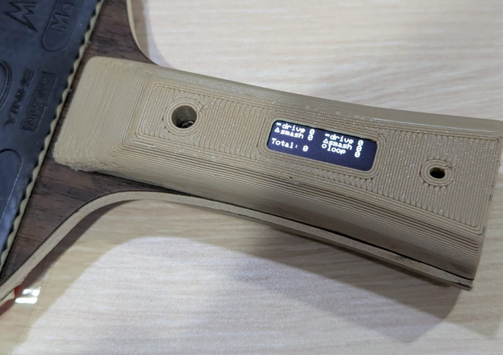
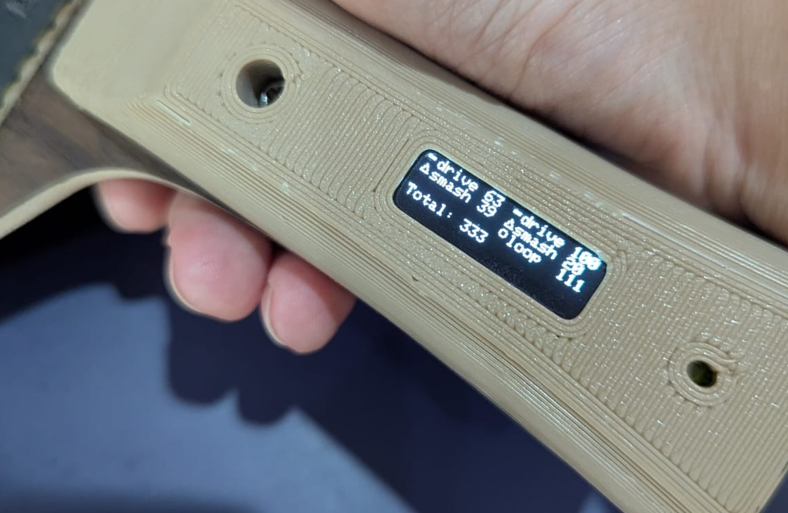


---

## Conclusion

This project turns a pro-feel blade into a smart training tool that gives objective, real-time feedback without getting in the way. The INT8 model runs in about 12 ms and the full loop updates the OLED in roughly 250 to 500 ms, so confirmations land while you are still hitting. Accuracy holds at 96.4% on validation and 88.7% on held-out test data. The model footprint is small (about 1.5 KB RAM, 16.8 KB Flash) and battery life is around 2.5 hours per session. With FFT-based features and simple decision gates, you get reliable stroke recognition and motivating feedback, all inside a bat that still feels like the real thing.

---
